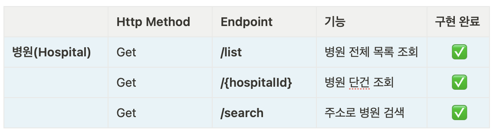

# 🏥 전국 병/의원 정보 사이트
## 📍 프로젝트 개요 [미니 프로젝트]
- 전국 병/의원 정보 조회 및 주소로 검색이 가능한 서비스
- 약 11만건의 전국 병/의원 정보를 parsing한 데이터를 이용
- JPA로 REST API 만들기 실습 
- docker로 프로젝트 배포 실습 

## 🗓️ 개발 기간 
- 22/11/11 ~

## 🚜 개발 환경
- Spring Boot 2.7.5
- Gradle 7.5.1
- Java 11

## 🛠️ Tech stacks

	
    
    
     
    
    
    
     
    
    
    

## ⚙️ Endpoints (/api/v1/hospitals)

